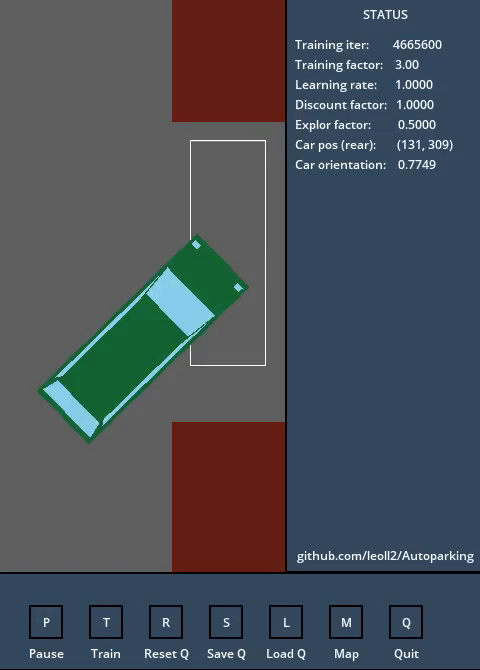

# Autoparking

The project simulates a typical car parking scenario, where a car has to make maneuvers to correctly re-position itself while avoiding near obstacles. The vehicle is 'intelligent', which means that it autonomously learns how to accomplish the task. This is done using Q-learning, a popular reinforcement learning technique.

This is what the trained model looks like:




## Implementation details

+ Everything has been implemented from scratch by me, with the only exception of graphics libraries (Allegro).  
+ Everything has been implemented in C/C++.  
+ Nothing has been implemented using frameworks or high-level libraries, including the AI stuff.

## Files and Folders

**bin** -> contains the executable binaries after building  
**build** -> contains the .o object files generated during the compilation  
**cache** -> contains pre-trained weights of Q and R so that you can skip the learning phase  
**conf** -> contains the configuration files  
**docs** -> contains a pdf file with interesting information about this project. Give it a look!  
**font** -> contains few fonts used by the application  
**img** -> contains the gif image above  
**Makefile** -> just a makefile  
**README** -> this file  
**src** -> contains the most important source files, here's the core of the application  
**stats** -> contains some data for statistical purposes generated during the training, if logging is enabled  

## Installation

First of all, download this repository with:
```
git clone https://www.github.com/leoll2/Autoparking.git
```

Then, you need to install Allegro5. The following steps apply to Debian/Ubuntu and are based on the official [wiki](https://wiki.allegro.cc/index.php?title=Install_Allegro5_From_Git/Linux/Debian). Installation on other distros is similar, yet some dependencies may differ. For instance, Centos/RHEL users shall refer to the relative [documentation](https://wiki.allegro.cc/index.php?title=Install_Allegro5_From_Git/Linux/Centos).
Honestly, I'm not sure which deps are strictly necessary and which are not, but unless you have limited storage capacity, I advise to download them all.

First, setup your repo list
```
cd /etc/apt/
sudo gedit sources.list
```
and add `contrib` and `free` at the end of those lines starting with deb or deb-src. Then update:

```sudo apt-get update```

Now install required dependencies:
```
sudo apt-get install build-essential git cmake cmake-curses-gui xorg-dev libgl1-mesa-dev libglu1-mesa-dev
```
and "optional" ones:
```
sudo apt-get install -y cmake g++ freeglut3-dev libxcursor-dev libpng-dev libjpeg-dev libfreetype6-dev libgtk2.0-dev libasound2-dev libpulse-dev libopenal-dev libflac-dev libdumb1-dev libvorbis-dev libphysfs-dev
```

From the Autoparking directory, clone the Allegro5 git repository:
```
git clone https://github.com/liballeg/allegro5.git
```
and switch to version 5.2.4:
```
git checkout 5.2.4
```
Setup the compilation:
```
mkdir build
cd build
ccmake -DCMAKE_INSTALL_PREFIX=/usr ..
```
Inside the cmake environment, press 'C' (configure) and 'E' if it complains about few missing libraries (don't worry, it still works). Then press 'G' (generate).

Here comes the fun, compilation:
```
make
```
You can optionally add the -j option to parallelize (speed up) the compilation on multiple cores.  
Finally, install:
```
make install
```

If all the previous steps went fine, Allegro5 is properly installed and setup.  
All you need now is to compile the Autoparking application, which is very easy. Switch back to the Autoparking directory, and run:
```
make
```

You're done! Enjoy the simulation!
```
bin/main
```

## Disclaimer

This work has been carried out as final project for the 'Neural Networks' exam at SSSUP. Anyway, anyone is encouraged to fork, modify or extend it for non-commercial purposes, as long as the original author (that's me) is explicitly credited. Feel free to contact me for any doubt!
